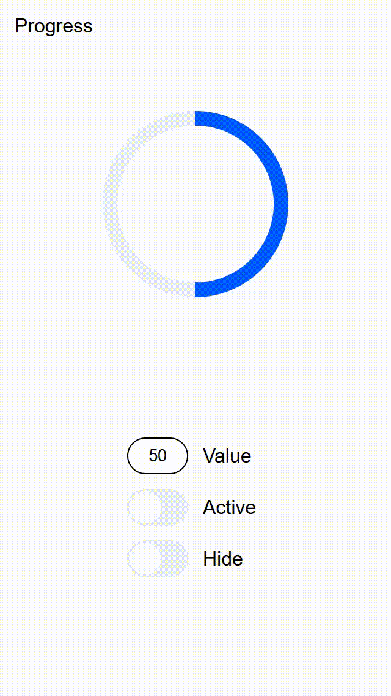
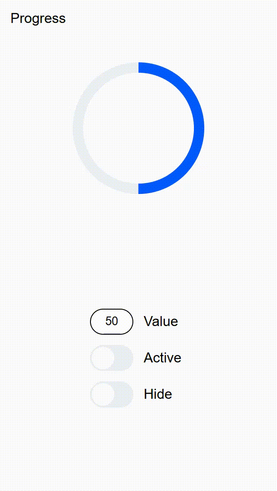

# Тестовое задание
## Progress Circle

Разработать прототип блока Progress для использования в мобильных web-приложениях.
Основное предназначение блока отображать процесс выполнения процессов и их прогресс
выполнения.

## Демонстрация

Ссылка [ProgressCircle](https://iBlessme.github.io/ProgressCircle)

## Выполненые задачи

- Переиспользование блока ProgressCircle
- Управление состоянием через API
- Демо адаптированно под мобильные устройства
- На демо можно управлять состоянием через пункт управления

## Технологии

- JS - без jQuery и других библиотек / фреймворков, упрощающих и дополняющих
  функциональность окружения браузера
- CSS
- HTML - без использования шаблонизаторов.

## Описание API

| Метод       | Описание                                | props              |
|-------------|-----------------------------------------|--------------------|
| setValue    | Установить значение                     | value (number)     |
| getValue    | Получить значение                       | -                  |
| setAnimated | Запустить анимацию бесконечной загрузки | activate (boolean) |
| setHidden   | Скрыть блок загрузки                    | activate (boolean) |

## Инструкция

1) Импортировать папку progressCircle в проект
2) Обьявить  ``` <div  id="progressContainer"></div> ``` где требуется вставка блока
` Вместо  progressContainer можно указать любой id `
3) Импортировать стили в необходимый html файл progressCircle.css
4) Импортировать скрипт в необходимый html файл progressCircle.js
5) В файле скрипта данной страницы вызвать инициализацию экземпляра
   ``` const progressCircle = new ProgressCircle('progressContainer'); ```
   `progressContainer -> id контейнера который мы указали на втором шаге (Можно создать несколько разных экземпляров)`


## Пример работы 


# Состояние Normal



# Состояние Active


# Состояние Hidden


[//]: # (# Ориентация экрана &#40;поворот экрана&#41;)

[//]: # (![screen-capture.gif]&#40;assets/demo/landscape.gif&#41;)